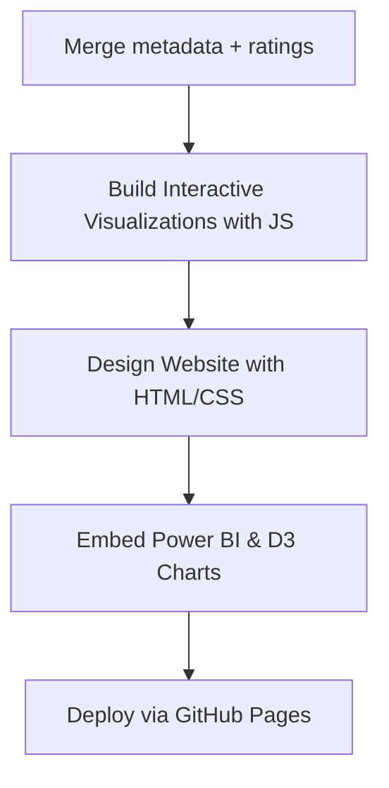

# 🎬 Cinematic Trends: Exploring Movie Metadata and Viewer Preferences

This project uncovers **what makes a movie successful** by analyzing metadata and viewer ratings from The Movie Database (TMDB) using **Python, Power BI, and interactive web technologies**. Through visual dashboards and a dynamic website, we explore trends across genres, revenue, budgets, and more.

---

## 📌 Overview

* Analyze TMDB movie metadata and user ratings
* Create actionable insights through data cleaning, feature engineering, and BI dashboards
* Deploy an interactive visualization website using HTML/CSS/JavaScript and Power BI

---

## 🎯 Project Goals

* 🎞️ Viewer sentiment across genres
* 💰 Budget vs. revenue analysis
* 📈 Popularity trends over time
* 🌐 Language-based film performance
* 🏢 Production company revenue efficiency
* 🌍 Deploy an interactive website for exploration

---

## 🗃️ Dataset Details

**Source**: [TMDB Movie Dataset on Kaggle](https://www.kaggle.com/datasets/tmdb/tmdb-movie-metadata)

| File                  | Description                                                   |
| --------------------- | ------------------------------------------------------------- |
| `movies_metadata.csv` | Movie info like title, genre, budget, revenue, language, etc. |
| `ratings.csv`         | 100,000+ user ratings with scores and timestamps              |
| `movies_data.csv`     | Final cleaned and merged dataset                              |

---

## 🛠️ Tools & Technologies

### 📊 Phase 1 – Data Analysis & Dashboarding

* Python (Pandas, NumPy)
* Google Colab
* Power BI (DAX, custom visuals)
* JSON Parsing

### 💻 Phase 2 – Website & Interactivity

* HTML / CSS / JavaScript
* D3.js, Plotly.js for charts
* Power BI Embedded
* GitHub Pages (Deployment)

---

## ⚙️ Workflow

### 📈 Phase 1: Data Wrangling & Visualization

```mermaid
graph TD;
    A[Collect Data from Kaggle] --> B[Clean & Transform using Python];
    B --> C[Feature Engineering (Profit, ROI, Genres, etc.)];
    C --> D[Export Clean Data to Power BI];
    D --> E[Create Dashboards & Visualizations];
```

### 🌐 Phase 2: Web Development & Publishing



---

## 🌍 Live Website

**Interactive Dashboard**: [https://sashi789.github.io/SDV\_project](https://sashi789.github.io/SDV_project)

> Explore genres, languages, ratings, popularity trends, and more with filters and animations.

---

## 📊 Visualizations Showcase

* 💸 Revenue vs Budget (Scatter)
* ⭐ Average Ratings by Genre (Bar)
* 📈 Trending Popularity (Line)
* 🔵 Vote Count vs Rating (Bubble)
* 🌍 Movies by Language (Donut)
* 🏢 Top Production Companies (Combo Chart)
* 🔥 Genre vs Language Heatmap
* 🧮 Rating Distribution (Histogram)
* 🎨 D3.js-based Rating Spread (Interactive)

---

## 📜 License & Credits

This project is for educational purposes only. TMDB data is used under **Creative Commons Attribution-NonCommercial 4.0**.

---

## 🙋‍♂️ Author

**Nithish Karanam**
Data Science | Web Development | BI Dashboards
GitHub: [https://github.com/Nithishkaranam2002](https://github.com/Nithishkaranam2002)

